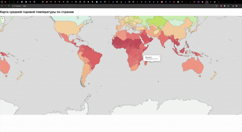

### Interactive countries annual temperature map ###
(_If map is not loading for some time, just wait for few minutes, tileserver deployed on Render on free instance which will spin down with inactivity_)

_data (.geojson) was taken from [here](https://globaldatalab.org/geos/table/surfacetempyear/)_ <br>
_.mbtiles file was generated from large .geojson file with [this tool](https://github.com/mapbox/tippecanoe)_<br>
_since GitHub gives only 1GB of LFS bandwith and .mbtiles file is over 100Mb, deployment might be not working, so see the gif demo_:
<p align="center">

</p>

You need running tileserver-gl server with your .mbtiles file.
To run tileserver-gl you need to install it via npm and create config.json file like this:
```
{
    "options": {
        "headers": {
            "Access-Control-Allow-Origin": "*"
        }
    },
    "data": {
        "localized_with_temps": {
            "mbtiles": "localized_with_temps.mbtiles"
        }
    }
}
```
Then you run this server from directory where you've created config.json using:
```
tileserver-gl --config config.json
```
Note that may throw CORB warning when you try to access it from your code directly. To avoid this you should create proxy server which will transfer given requests to tileserver-gl server itself. 
For example like this:
```
app.use('/tiles', (req, res, next) => {
    const cacheKey = req.originalUrl;
    const cachedResponse = cache.get(cacheKey);

    if (cachedResponse) {
        res.set(cachedResponse.headers);
        res.send(cachedResponse.body);
    } else {
        createProxyMiddleware({
            target: 'http://localhost:8080',
            changeOrigin: true,
            pathRewrite: { '^/tiles': '' },
            onProxyRes: (proxyRes, req, res) => {
                const body = [];
                proxyRes.on('data', (chunk) => body.push(chunk));
                proxyRes.on('end', () => {
                    const response = {
                        headers: proxyRes.headers,
                        body: Buffer.concat(body)
                    };
                    cache.set(cacheKey, response);
                });
            }
        })(req, res, next);
    }
});
app.listen(3000, () => {
    console.log('Прокси-сервер запущен на http://localhost:3000');
});
```
(_You can visit [proxy-server repository](https://github.com/dtfyu3/tileservergl-proxy)_)


And you simply replace link here from ```localhost:8080``` to ```localhost:port_that_your_proxy_is_on```:
```
 const vectorTiles = L.vectorGrid.protobuf(
        'http://localhost:3000/tiles/data/YOUR_NAME/{z}/{x}/{y}.pbf', {
        rendererFactory: L.canvas.tile,
        interactive: true,
        ...
        ...
```
